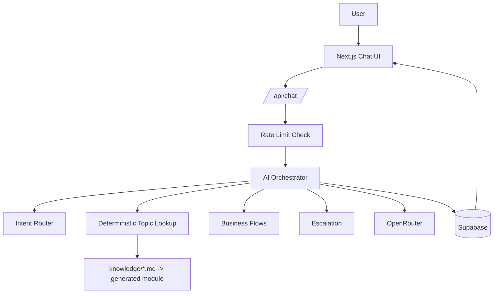

# Cadre AI Chatbot

Customer-support chatbot for the Cadre AI take-home challenge.

This project focuses on a small, production-oriented MVP:

- grounded Cadre knowledge answers
- intent routing
- booking guidance
- client portal guidance
- unsupported-question handling
- explicit escalation
- rate limiting
- Supabase persistence
- CI/CD to Firebase App Hosting

The goal is not to build the biggest chatbot. It is to build a reliable one that is easy to explain, easy to verify, and safe to extend.

## Architecture



## What the assistant can do

- answer supported Cadre questions with grounded content
- recognize intent for common support flows
- guide users toward a strategy call
- explain client portal limitations
- escalate when information is missing or unsupported

## What it will not do

- invent Cadre facts
- pretend to access a client portal
- claim unsupported security or pricing details
- require login for a public support conversation
- route through extra AI providers in the shipped app

## Project docs

- [`CLAUDE.md`](./CLAUDE.md) is the operating manual for the coding agent.
- [`PLAN.md`](./PLAN.md) is the execution plan and phase checklist.

## Local setup

1. Install dependencies.
2. Add the required environment variables to `.env.local`.
3. Generate the knowledge module.
4. Start the dev server.

```bash
npm install
npm run build:knowledge
npm run dev
```

## Environment variables

The app is designed to keep secrets server-side only.

Expected variables:

- `OPENROUTER_API_KEY`
- `OPENROUTER_MODEL`
- `SUPABASE_URL`
- `SUPABASE_ANON_KEY`
- `SUPABASE_SERVICE_ROLE_KEY`
- `FIREBASE_PROJECT_ID`
- `FIREBASE_BACKEND_ID`
- `FIREBASE_REGION`

Do not commit secret values.

## Deployment

The intended production flow is:

1. push to `main`, or run the workflow manually
2. GitHub Actions runs validation
3. if validation passes, the Supabase migrations job runs
4. if that succeeds, the Firebase rollout is triggered explicitly
5. the deployed app appears on the Firebase App Hosting URL

This is intentionally conservative so broken code does not roll out automatically.

## Design decisions

- Deterministic-first grounding for Cadre knowledge
- OpenRouter only in the shipped app
- Mock provider for local testing
- No user accounts
- Rate limiting instead of auth
- Supabase for persistence
- CI before deploy

## Known limits

- Multi-device sync is not part of the initial scope.
- The app should prefer safe escalation over guesswork.

## Demo flow

Use these prompts during a review:

1. What does Cadre AI do?
2. Do you work with my industry?
3. How can I get started?
4. I want to speak with someone.
5. How do I access the client portal?
6. What is your pricing?
7. Attempt a prompt injection message.

Each one should demonstrate a different routing or safety behavior.
